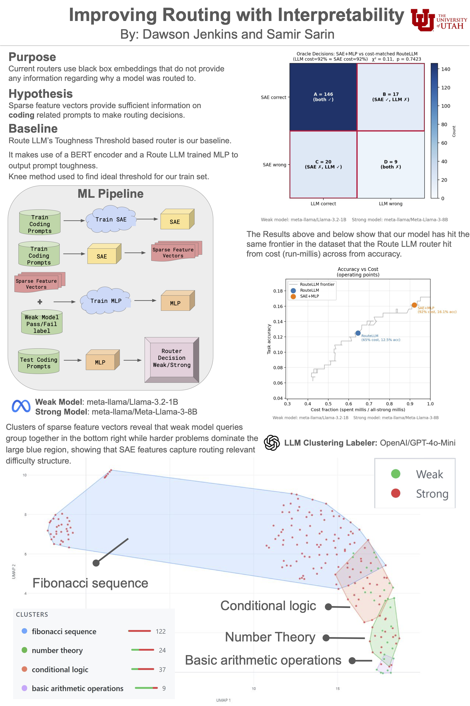

# ClearRouter — Interpretable LLM Routing via Sparse Autoencoders



ClearRouter is a research pipeline that routes code-generation tasks to a weak or strong language model based on task difficulty. Instead of a black-box classifier, routing decisions are made by an MLP trained on sparse, interpretable features extracted from model activations via a [Sparse Autoencoder (SAE)](https://transformer-circuits.pub/2023/monosemantic-features/index.html).

The pipeline is evaluated on [HumanEval-XL](https://huggingface.co/datasets/FloatAI/HumanEval-XL) and benchmarked against [RouteLLM](https://github.com/lm-sys/RouteLLM)'s built-in BERT router.

---

## How It Works

```
HumanEval-XL dataset
        │
        ├──────────────────────────────────────────┐
        ▼                                          ▼
  Weak model inference                   Strong model inference
  (Llama-3.2-1B via vLLM)               (Llama-3-8B via vLLM)
        │
        ▼
  Activation extraction (TransformerLens)
        │
        ▼
  SAE → sparse feature vectors
        │
        ▼
  MLP classifier → route decision (weak / strong)
        │
        ▼
  Evaluation: pass@1 vs. cost (Pareto frontier)
```

SAE features are human-interpretable — each dimension corresponds to a detectable concept in the model's representation space, making routing decisions auditable rather than opaque.

---

## Models

| Role   | Model                         |
|--------|-------------------------------|
| Weak   | `meta-llama/Llama-3.2-1B`     |
| Strong | `meta-llama/Meta-Llama-3-8B`  |

Inference runs via vLLM (FP16) behind a litellm proxy. Activation extraction uses TransformerLens with the same weights and tokenizer, keeping inference and activation inputs aligned.

---

## Requirements

- Python 3.10+
- CUDA-capable GPU(s) with ≥19 GB VRAM total (to run both models simultaneously)
- Docker (for code evaluation only — not needed for training or inference)
- HuggingFace account with access to gated Llama models

---

## Local Setup

### 1. Clone and create a virtual environment

```bash
git clone https://github.com/your-org/ClearRouter.git
cd ClearRouter
python -m venv .venv

# macOS / Linux
source .venv/bin/activate

# Windows
.venv\Scripts\activate
```

### 2. Install dependencies

```bash
pip install -r requirements.txt
```

For GPU acceleration (recommended — adjust CUDA version to match your installation):

```bash
pip install torch torchvision --index-url https://download.pytorch.org/whl/cu130
```

### 3. Authenticate with HuggingFace

Both models are gated and require a free HuggingFace account.

1. Accept the license for each model:
   - [meta-llama/Llama-3.2-1B](https://huggingface.co/meta-llama/Llama-3.2-1B)
   - [meta-llama/Meta-Llama-3-8B](https://huggingface.co/meta-llama/Meta-Llama-3-8B)

2. Log in locally:
   ```bash
   huggingface-cli login
   ```

Models are downloaded on first use and cached in `~/.cache/huggingface/`.

> **CHPC / scratch space:** set `HF_HOME` before logging in:
> ```bash
> export HF_HOME=/scratch/general/vast/$USER/.cache/huggingface
> ```

### 4. Initialize the database

```bash
python cli.py init-db
```

This creates the SQLite database and seeds the initial train/test split.

---

## Running the Pipeline

Run stages in order. Each stage persists its output to the database or a local directory.

```bash
# 1. Start inference servers (downloads models on first run — takes a few minutes)
python cli.py up

# 2. Run inference with both models
python cli.py inference --model all

# 3. Evaluate completions against test cases (requires Docker)
python cli.py test

# 4. Stop inference servers
python cli.py down

# 5. Extract activations from the weak model
python cli.py extract-activations

# 6. Train the Sparse Autoencoder on activations
python cli.py train-sae

# 7. Extract sparse feature vectors from the trained SAE
python cli.py extract-spv

# 8. Train the MLP router on sparse feature vectors
python cli.py train-mlp

# 9. Compute routing decisions and result statistics
python cli.py calculate-sae-router-choices
python cli.py calculate-route-llm-choices
python cli.py result-stats
```

All commands accept `--split train|test` (default: `train`).

### Inference server options

```bash
python cli.py up --weak-gpu 0 --strong-gpu 1   # default: one model per GPU
python cli.py up --single-gpu                   # both models on GPU 0 (~19 GB VRAM)
python cli.py status                            # check running servers
```

Server logs are written to `logs/servers/`.

### Regenerate the data split

```bash
python cli.py split    # stratified 80/20 train/test split by language
```

---

## Running on a Cluster (SLURM)

Each pipeline stage has a corresponding job script in `jobs/`. Submit them in order:

```bash
sbatch jobs/run_inference.sh
sbatch jobs/run_test_model_code.sh
sbatch jobs/run_extract_activations.sh
sbatch jobs/run_train_sae.sh
sbatch jobs/run_train_mlp.sh
sbatch jobs/run_calculate_sae_router_choices.sh
sbatch jobs/run_calculate_route_llm_choices.sh
sbatch jobs/run_calculate_result_stats.sh
```

Inference and evaluation are intentionally separated: expensive GPU inference runs on the cluster, while Docker-based code evaluation runs locally with no GPU required.

---

## Evaluation

Results are analyzed on a Pareto frontier of pass@1 accuracy vs. routing cost (fraction of queries sent to the strong model). The goal is to match or exceed the strong model's accuracy while minimizing how often it is used.

```bash
python scripts/compare_routers.py    # compare SAE router vs. RouteLLM baseline
python scripts/cluster_visualizer.py # visualize SAE feature clusters
```

---

## Project Structure

```
cli.py                           ← sole entry point for all commands

util/
  inference_util.py              ← shared inference loop and client setup
  database_util.py               ← DB init and seeding
  database_connection_util.py    ← connection factory (single source of truth)
  model_util.py                  ← inference server lifecycle
  tensor_util.py
  unit_test_util.py
  smart_file_util.py

daos/                            ← database access layer (SQLite, no ORM)
  tasks_dao.py
  split_dao.py
  task_split_dao.py
  model_task_result_dao.py
  runs_dao.py

route_llm/                       ← RouteLLM baseline
  toughness.py                   ← BERT router scoring
  calculate_threshold.py

sae/                             ← Sparse Autoencoder pipeline
  train_sae.py                   ← SAE training
  extract_spv.py                 ← sparse feature vector extraction

mlp/                             ← MLP router
  mlp_train.py
  eval_mlp.py
  model.py

scripts/
  compare_routers.py             ← Pareto frontier analysis
  cluster_visualizer.py          ← SAE feature cluster visualization

jobs/                            ← SLURM job scripts (one per pipeline stage)

# Gitignored — generated at runtime
activations/                     ← dense activation tensors (.pt)
sae_output/                      ← trained SAE weights and configs
mlp_output/                      ← trained MLP weights
```

---

## Output File Formats

| Stage | Format | Path |
|-------|--------|------|
| Inference results | SQLite (also exportable as JSONL) | `routing.db` |
| Activation tensors | PyTorch `.pt` | `activations/activations_<split>_<model>.pt` |
| SAE weights | SafeTensors | `sae_output/sae_<split>_<model>_weights.safetensors` |
| SAE config | JSON | `sae_output/cfg_<split>_<model>.json` |
| MLP weights | PyTorch `.pt` | `mlp_output/mlp_<split>_<model>.pt` |

---

## Contributing

Pull requests are welcome. For significant changes, please open an issue first to discuss the approach.

---

## License

MIT
